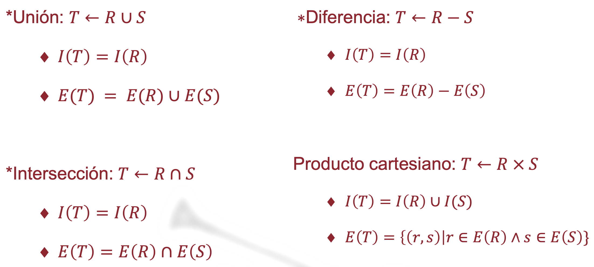
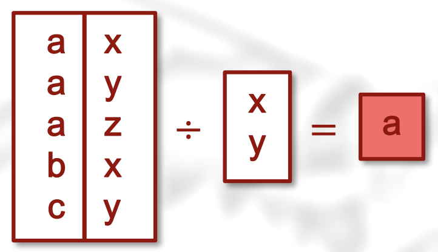

#### Clase del 21 de Octubre de 2024
#### Miguel Toro Llamas

# Tema 9: Álgebra Relacional

## Operadores Conjuntistas

Para hacer uniones y cualquier operación, las tablas R y S deben de ser compatibles.



Para hacer operaciones, usamos los siguientes operadores:
### Operador de Unión
Con la unión vemos ambas tablas una concatenada con la otra.
```sql
SELECT * FROM a
UNION
SELECT * FROM b;
```
### Operador de Diferencia
Vemos todo lo de la tabla a, menos lo que aparece en la tabla b
```sql
SELECT * FROM a
EXCEPT
SELECT * FROM b;
```

### Operador de Intersección
Vemos lo que tienen en común ambas tablas.
```sql
SELECT * FROM a
INTERSECTION
SELECT * FROM b;
```

### Producto Cartesiano
Si a tiene x filas, y b tiene y filas, la tabla resultante obtiene x · y filas; de igual manera para las columnas.
```sql
SELECT * FROM a, b;
```

## Operadores Relacionistas
Aplicando restricciones y filtros obtenemos los resultados que queramos

### Operador de Selección
Con la `selección`, mostramos los resultados que queramos que cumplan una condición, podemos usar `WHERE`:
```sql
SELECT * FROM a WHERE {condicion};
```
Basicamente estamos obteniendo las filas que queramos.

### Operador de Proyección
En cambio, en la `proyección` consiste en ver algunos atributos de una tabla, lo que es decir, filtrarlo por columnas:
```sql
SELECT distinct atributo_A, atributo_B FROM a;
-- Con el `distinc` nos quitamos los elementos duplicados (pero no es necesario en álgebra)
```

### Operador de Combinación Natural
El `natural join` es es lo mismo que hacer un producto cartesiano con una restricción:

```sql
SELECT * FROM tablaa A, tablab B 
WHERE A.atributoA=B.atributoB;

-- con el natural join quedaría de la siguiente manera:

SELECT FROM tablaa NATURAL JOIN tablab;
```

### Operador de División
Sean R(r,s) y S(s) dos relaciones, la división R/S
devuelve los valores de r tales que para todo
valor de s en S existe una tupla (r,s) en R.



En sql lo podemos escribir así:
```sql
-- Ver ejemplo al final del documento.
```

# Consultas sobre la Base de Datos `Pedidos`

Escribiendo esto obtenemos una tabla con el filtro que queramos.
```sql
SELECT name nombre, province provincia FROM users U
WHERE U.province='Sevilla';
 
-- o también...

SELECT * FROM users WHERE price > 20;
```

Si escribimos lo siguiente:
```sql
SELECT * FROM users
UNION
SELECT * FROM provincia;
```
Obtenemos un error, porque las tablas no son compatibles entre sí. Han de serlo si queremos hacer operaciones con ellas.

En el siguiente código, estamos usando una restricción con `WHERE` y un producto cartesiano.
```sql
SELECT 0.* name, province, startDate 
FROM orders O, users U 
WHERE O.usersId=U.userId;
```

De igual manera, podemos usar el `NATURAL JOIN`
```sql
SELECT FROM orders NATURAL JOIN users;
```

### Ejemplo de División
```sql
SELECT userid FROM users; -- Todos los usuarios que existen
SELECT productid FROM products; -- Todo los productos
SELECT userid, productid FROM users, products; -- Todas las combinaciones posibles Usuario-Producto

SELECT userid, productid FROM orders -- Combinaciones que existen

-- Diferencia de todas menos las que existen:
SELECT userid, productid FROM users, products
EXCEPT
SELECT userid, productid FROM orders;

SELECT userid FROM (
SELECT userid, productid FROM users, products
EXCEPT
SELECT userid, productid FROM orders) guacamole;

SELECT name FROM users
WHERE userid NOT IN (
SELECT userid FROM (
SELECT userid, productid FROM users, products
EXCEPT
SELECT userid, productid FROM orders) guacamole);

-- Prueba fallida:
SELECT name FROM users
EXCEPT (
SELECT userid FROM (
SELECT userid, productid FROM users, products
EXCEPT
SELECT userid, productid FROM orders) guacamole);
```


## Ejercicios
### Nombre de Usuarios que No han realizado ningún Pedido

```sql

SELECT distinct userid FROM orders; -- Usuarios con pedidos

SELECT userid FROM users ORDER BY 1; -- Todos los usuarios

-- Usamos un except para restar las tablas:
SELECT userid FROM users
EXCEPT
SELECT userid FROM orders;

-- Para obtener el nombre del usuario, vamos a hacer un natural join:
SELECT name FROM users NATURAL JOIN
(SELECT userid FROM users
EXCEPT
SELECT userid FROM orders) X;
```