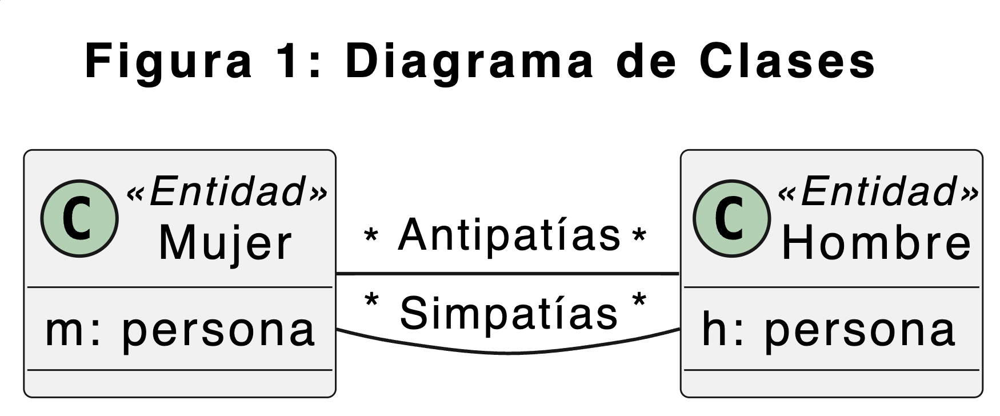

# Ejercicio de Simpatías

## Creación del Entorno
### Modelado Conceptual

En este diagrama observamos las relaciones existentes entre las entidades.
### Base de Datos Relacional
```sql
/*  Crear la Base de Datos Simpatias*/
CREATE OR REPLACE DATABASE simpatias CHARACTER SET = utf8 COLLATE = 'utf8_general_ci';
USE simpatias;
/* 	Definición de tablas */
CREATE OR REPLACE TABLE hombres ( h VARCHAR(20) KEY );
CREATE OR REPLACE TABLE mujeres ( m VARCHAR(20) KEY );
CREATE OR REPLACE TABLE simpatias ( 
	h VARCHAR(20), 
	m VARCHAR(20),
	PRIMARY KEY (h, m), 
	FOREIGN KEY (h) REFERENCES hombres (h),
	FOREIGN KEY (m) REFERENCES mujeres (m)
	);
CREATE OR REPLACE TABLE antipatias (
	h VARCHAR(20), 
	m VARCHAR(20),
	PRIMARY KEY (h, m),
	FOREIGN KEY (h) REFERENCES hombres (h),
	FOREIGN KEY (m) REFERENCES mujeres (m)
	);	
```
Una vez creadas las tablas con las que vamos a trabajar, vamos a llenarlas con datos como escenario de prueba:
```sql 
/* Escenario de prueba */
INSERT INTO hombres VALUES ('Juan'), ('Pedro'), ('Manuel'), ('Ataulfo');
INSERT INTO mujeres VALUES ('Ana'), ('Rosa'), ('Carmen'), ('Segismunda');
INSERT INTO simpatias VALUES 
	('Juan', 'Ana'),
	('Pedro', 'Rosa'),
	('Manuel', 'Ana'),
	('Manuel', 'Rosa'),
	('Manuel', 'Carmen'),
	('Manuel', 'Segismunda');
INSERT INTO antipatias VALUES 
	('Juan', 'Rosa'), 
	('Pedro', 'Segismunda'), 
	('Ataulfo', 'Ana'),
	('Ataulfo', 'Rosa'),
	('Ataulfo','Segismunda');
```
## Resuelva las Siguientes Consultas en Álgebra Relacional y SQL
### q1: ¿Mujeres que gustan a 'Pedro'?
En `Álgebra Relacional`:
$$
\prod_m \left(\underset{h = 'Pedro'}{\sigma} (simpatias)\right)
$$
En `SQL`: 
```sql
SELECT DISTINCT m FROM simpatias
WHERE h = 'Pedro';
```
### q2: ¿Hombres antipáticos a 'Rosa'?
En `Álgebra Relacional`:
$$
\prod_h \left(\underset{m='Rosa}{\sigma} (antipatias) \right)
$$
En `SQL`:
```sql
SELECT DISTINCT h FROM antipatias
WHERE m = 'Rosa';
```
### q3: ¿Mujeres simpáticas a alguien?
En `Álgebra Relacional`:
$$ \prod_m (simpatias) $$
En `SQL`:
```sql
SELECT DISTINCT m FROM simpatias;
```
### q4: ¿Hombres antipáticos a alguien?
En `Álgebra Relacional`:
$$ \prod_h(antipatias) $$
En `SQL`:
```sql
SELECT DISTINCT h FROM antipatias;
```
### q5: ¿Hombres que no son simpaticos a nadie?
En `Álgebra Relacional`:
$$ \prod_h (hombres) - \prod_h (simpatias)$$
En `SQL`:
```sql
SELECT h FROM hombres 
EXCEPT
SELECT h FROM simpatias;
```
Otra forma de hacerlo es con `WHERE NOT EXISTS`:
```sql
SELECT h FROM hombres H
WHERE NOT EXISTS (SELECT * FROM simpatias S WHERE H.h=S.h)
```
### q6: ¿Mujeres que no son antipaticas a nadie?
En `Álgebra Relacional`:
$$ \prod_m (mujeres) - \prod_m(antipatias) $$
En `SQL`:
```sql
SELECT m FROM mujeres
EXCEPT
SELECT m FROM antipatias;
```
Otra forma de hacerlo es con `WHERE NOT EXISTS`:
```sql
SELECT m FROM mujeres M
WHERE NOT EXISTS (SELECT * FROM antipatias A WHERE A.m=M.m);
```
### q7: ¿Hombres que caen simpáticos a todas las mujeres?
En `Álgebra Relacional`:
$$
\frac{\text{simpatías}}{\text{mujeres}} = 
\left( \prod_h (\text{simpatías}) \right) - 
\left( 
\prod_h 
\left( 
\left( \prod_h (\text{simpatías}) \right) \times \text{mujeres} 
\right) - (\text{simpatías}) 
\right)
$$
En `SQL`:
```sql 
-- Selecciona todos los hombres (h) distintos de la tabla 'simpatias' con el alias 'Sx'
SELECT DISTINCT h FROM simpatias Sx
-- Donde no existe ninguna mujer (m) en la tabla 'mujeres' con el alias 'M'
WHERE NOT EXISTS (
    -- Para la cual no existe una entrada en la tabla 'simpatias' con el alias 'Sy'
    SELECT * FROM mujeres M
    WHERE NOT EXISTS (
        -- Donde la mujer (m) y el hombre (h) coinciden con los de la tabla 'Sx'
        SELECT * FROM simpatias Sy
        WHERE Sy.m = M.m AND Sy.h = Sx.h
    )
);
```
### q8: ¿Hombre que cae simpático al mayor número de mujeres?
En `Álgebra Relacional`:
$$
\prod_h 
\left(
\text{count}(*) = \Upsilon^{\max(\text{cuenta})} 
\left( 
\sigma 
\left( 
\rho_{\text{cuenta} \leftarrow \text{count}(*)} 
\left( 
\Upsilon_h^{\text{count}(*)} \text{Simpatías} 
\right) 
\right) 
\left( 
\Upsilon_h^{\text{count}(*)} \text{Simpatías} 
\right)
\right)
\right)
$$
En `SQL`:
```sql
-- (a) Encadenando SELECTs sobre resultados temporales
SELECT h FROM simpatias 
GROUP BY h
HAVING COUNT(*) = ( SELECT MAX(cta) FROM ( SELECT COUNT(*) cta
FROM simpatias GROUP BY h ) X );


-- (b) Con Ordenación descendenta y selección del primero
SELECT h FROM simpatias 
GROUP BY h
HAVING COUNT(*) = ( SELECT COUNT(*) cta FROM simpatias
GROUP BY h ORDER BY 1 DESC LIMIT 1 );


-- (c) Aplicando la condición ALL sobre un conjunto
SELECT h FROM simpatias 
GROUP BY h
HAVING COUNT(*) >= ALL ( SELECT count(*) FROM simpatias GROUP BY h );


-- (d) Con una vista previa
CREATE VIEW V_HM_cta AS SELECT h, COUNT(*) cta FROM simpatias GROUP BY h;
SELECT h FROM V_HM_cta WHERE cta = ( SELECT MAX(cta) FROM V_HM_cta);
```